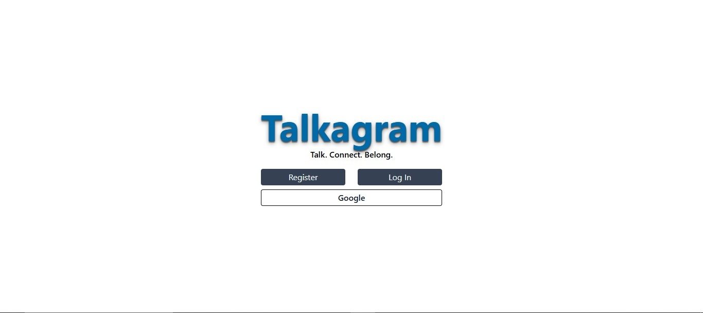
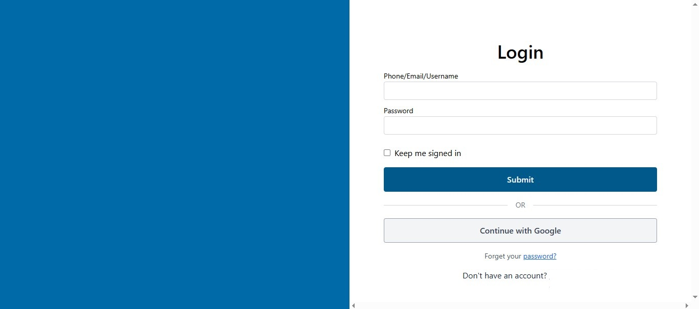
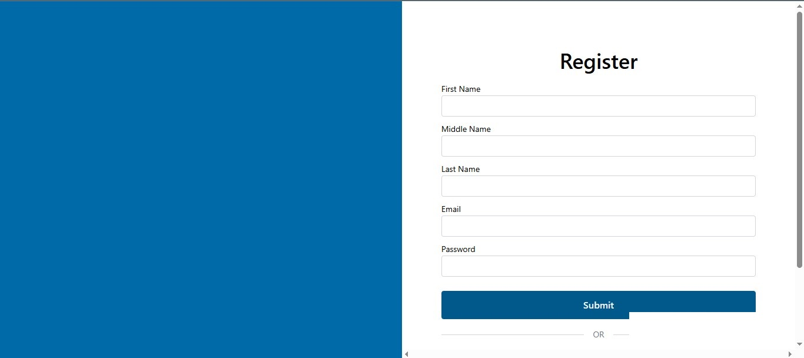

# Talkagram V2
🚧 ***This project and its documentation are currently under development.*** Its architecture, features, UI, and implementation details may change as development progresses.

This repository contains the frontend application for the chat application. It provides the user interface for interacting with the application's features, including user authentication, profile management, chat rooms, and real-time messaging.

The frontend communicates with the backend through the API Gateway and uses Socket.IO for real-time communication.

## Screenshots 

  
  
  

